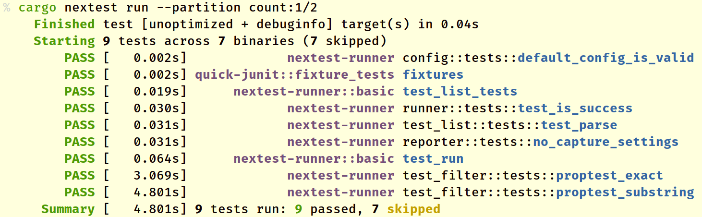

# Partitioning test runs in CI

For CI scenarios where test runs take too long on a single machine, nextest supports automatically *partitioning* or *sharding* tests into buckets, using the `--partition` option.

cargo-nextest supports two kinds of partitioning: *counted* and *hashed*.

## Counted partitioning

Counted partitioning is specified with `--partition count:m/n`, where m and n are both integers, and 1 ≤ m ≤ n. Specifying this operator means "run tests in count-based bucket m of n".

Here's an example of running tests in bucket 1 of 2:

Tests not in the current bucket are marked skipped.

Counted partitioning is done *per test binary*. This means that the tests in one binary *do not* influence counting for other binaries.

Counted partitioning also applies after all other test filters. For example, if you specify `cargo nextest run --partition count:1/3 test_parsing`, nextest first selects tests that match the substring `test_parsing`, then buckets this subset of tests into 3 partitions and runs the tests in partition 1.

## Hashed sharding

Hashed sharding is specified with `--partition hash:m/n`, where m and n are both integers, and 1 ≤ m ≤ n. Specifying this operator means "run tests in hashed bucket m of n".

The hash is completely deterministic, and is based on a combination of the binary and test names. The hash algorithm is guaranteed never to change within a nextest version series.

For sufficiently large numbers of tests, hashed sharding produces roughly the same number of tests per bucket. However, smaller test runs may result in an uneven distribution.

## Example: Use in GitHub Actions

See [this working example](https://github.com/nextest-rs/reuse-build-partition-example/blob/main/.github/workflows/ci.yml) for how to [reuse builds](reusing-builds.md) and partition test runs on GitHub Actions.
