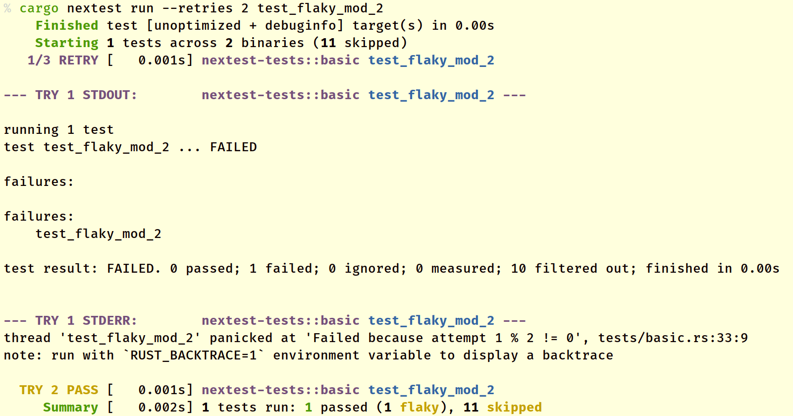

# Retries and flaky tests

Sometimes, tests fail nondeterministically, which can be quite annoying to developers locally and in CI. cargo-nextest supports *retrying* failed tests with the `--retries` option. If a test succeeds during a retry, the test is marked *flaky*. Here's an example:



`--retries 2` means that the test is retried twice, for a total of three attempts. In this case, the test fails on the first try but succeeds on the second try. The `TRY 2 PASS` text means that the test passed on the second try.

Flaky tests are treated as ultimately successful. If there are no other tests that failed, the exit code for the test run is 0.

Retries can also be:
* passed in via the environment variable `NEXTEST_RETRIES`.
* [configured in `.config/nextest.toml`](configuration.md).

For the order that configuration parameters are resolved in, see [Hierarchical configuration](configuration.md#hierarchical-configuration).

## Delays and backoff

In some situations, you may wish to add delays between retries. For example, if your test hits a network service which is rate limited.

In those cases, you can insert delays between test attempts with a backoff algorithm.

> **Note:** Delays and backoff can only be specified through configuration. Passing in `--retries` via the command line or specifying the `NEXTEST_RETRIES` environment variable will override delays and backoff specified through configuration.

### Fixed backoff

To insert a constant delay between test attempts, use the fixed backoff algorithm. For example, to retry tests up to twice with a 1 second delay between attempts, use:

```toml
[profile.default]
retries = { backoff = "fixed", count = 2, delay = "1s" }
```

### Exponential backoff

Nextest also supports [exponential backoff](https://en.wikipedia.org/wiki/Exponential_backoff), where the delay between attempts doubles each time. For example, to retry tests up to 3 times with successive delays of 5 seconds, 10 seconds, and 20 seconds, use:

```toml
[profile.default]
retries = { backoff = "exponential", count = 3, delay = "5s" }
```

A maximum delay can also be specified to avoid delays from becoming too large. In the above example, if `count = 5`, the fourth and fifth retries would be with delays of 40 seconds and 80 seconds, respectively. To clamp delays at 30 seconds, use:

```toml
[profile.default]
retries = { backoff = "exponential", count = 3, delay = "5s", max-delay = "30s" }
```

This effectively performs a [truncated exponential backoff](https://en.wikipedia.org/wiki/Exponential_backoff#Truncated_exponential_backoff).

### Adding jitter

To avoid [thundering herd problems](https://en.wikipedia.org/wiki/Thundering_herd_problem), it can be useful to add randomness to delays. To do so, use `jitter = true`.

```toml
[profile.default]
retries = { backoff = "exponential", count = 3, delay = "1s", jitter = true }
```

`jitter = true` also works for fixed backoff.

The current jitter algorithm picks a value in between `0.5 * delay` and `delay` uniformly randomly. This is not part of the stable API and is subject to change.

## Per-test overrides

Nextest supports [per-test overrides](per-test-overrides.md) for retries, letting you mark a subset of tests as needing retries. For example, to mark test names containing `"test_e2e"` as requiring retries:

```toml
[[profile.default.overrides]]
filter = 'test(test_e2e)'
retries = 2
```

Per-test overrides support the full set of delay and backoff options as well. For example:

```toml
[[profile.default.overrides]]
filter = 'test(test_remote_api)'
retries = { backoff = "exponential", count = 2, delay = "5s", jitter = true }
```

> **Note:** The `--retries` command-line option and the `NEXTEST_RETRIES` environment variable both disable overrides.

## JUnit support

Flaky test detection is integrated with nextest's JUnit support. For more information, see [JUnit support](junit.md).
