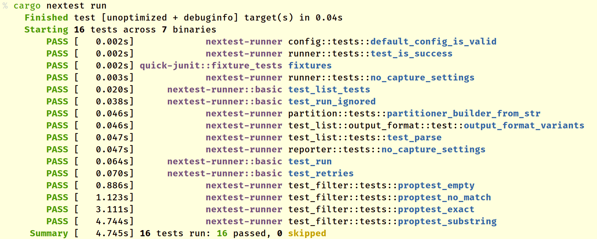

# Running tests

To build and run all tests in a workspace[^doctest], cd into the workspace and run:

```
cargo nextest run
```

This will produce output that looks like:



In the output above:

- Tests are marked **`PASS`** or **`FAIL`**, and the amount of wall-clock time each test takes is listed within square brackets. In the example above, **`test_list_tests`** passed and took 0.052 seconds to execute.
- Tests that take more than a specified amount of time are marked **SLOW**. The timeout is 60 seconds by default, and can be [changed through configuration](configuration.md).
- The part of the test in purple is the _binary ID_ for a unit test binary (see [Binary IDs](#binary-ids) below).

- The part after the binary ID is the _test name_, including the module the test is in. The final part of the test name is highlighted in bold blue text.

`cargo nextest run` supports all the options that `cargo test` does. For example, to only execute tests for a package called `my-package`:

```
cargo nextest run -p my-package
```

For a full list of options accepted by `cargo nextest run`, see `cargo nextest run --help`.

## Binary IDs

A test binary can be any of:

- A _unit test binary_ built from tests within `lib.rs` or its submodules. The binary ID for these are shown by nextest as just the crate name, without a `::` separator inside them.
- An _integration test binary_ built from tests in the `[[test]]` section of `Cargo.toml` (typically tests in the `tests` directory.) The binary ID for these is has the format `crate-name::bin-name`.
- Some other kind of test binary, such as a benchmark. In this case, the binary ID is `crate-name::kind/bin-name`. For example, `nextest-runner::bench/my-bench` or `quick-junit::example/show-junit`.

For more about unit and integration tests, see [the documentation for `cargo test`](https://doc.rust-lang.org/cargo/commands/cargo-test.html).

## Filtering tests

To only run tests that match certain names:

```
cargo nextest run -- <test-name1> <test-name2>...
```

### `--skip` and `--exact`

Nextest does not support `--skip` and `--exact` directly; instead, it supports more powerful [filter expressions] which supersede these options.

Here are some examples:

|               Cargo test command                |                     Nextest command                     |
| :---------------------------------------------: | :-----------------------------------------------------: |
| `cargo test -- --skip skip1 --skip skip2 test3` | `cargo nextest run -E 'test(test3) - test(/skip[12]/)'` |
|       `cargo test -- --exact test1 test2`       |  `cargo nextest run -E 'test(=test1) + test(=test2)'`   |

### Filtering by build platform

While cross-compiling code, some tests (e.g. proc-macro tests) may need to be run on the host platform. To filter tests based on the build platform they're for, nextest's filter expressions accept the `platform()` set with values `target` and `host`.

For example, to only run tests for the host platform:

```
cargo nextest run -E 'platform(host)'
```

[filter expressions]: filter-expressions.md

## Displaying live test output

By default, `cargo nextest run` will capture test output and only display it on failure. If you do _not_ want to capture test output:

```
cargo nextest run --no-capture
```

In this mode, cargo-nextest will run tests _serially_ so that output from different tests isn't interspersed. This is different from `cargo test -- --nocapture`, which will run tests in parallel.

[^doctest]: Doctests are currently [not supported](https://github.com/nextest-rs/nextest/issues/16) because of limitations in stable Rust. For now, run doctests in a separate step with `cargo test --doc`.

## Options and arguments

```
{{#include ../../help-text/run-help.txt}}
```
