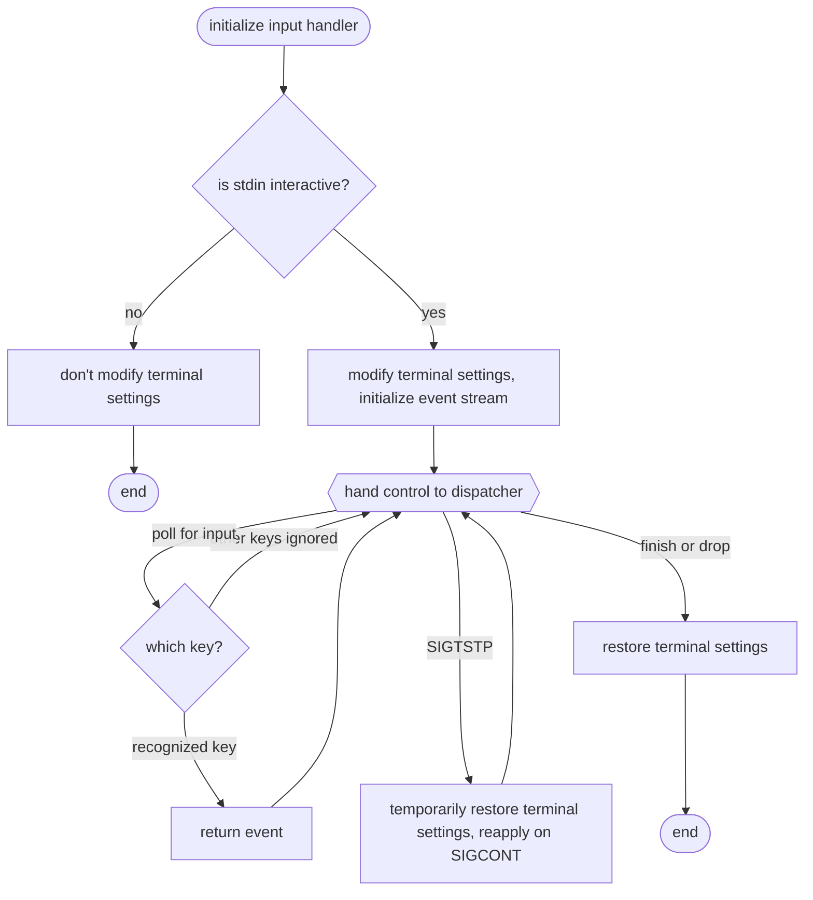

# Input handling

!!! abstract "Design document"

    This is a design document intended for nextest contributors and curious readers.

Currently, nextest handles keyboard inputs in interactive terminals (and on Unix, with the additional condition that it is in the foreground process group of the [controlling terminal](https://pubs.opengroup.org/onlinepubs/9799919799/basedefs/V1_chap11.html)):

- On `t` being pressed, nextest prints [the status and captured
  output](../../reporting.md#live-output) for currently-running tests.
- On Enter being pressed, nextest prints either a progress bar snapshot
  if the bar is visible, or a blank line if the bar is not visible.

This page describes why nextest handles keyboard inputs, and how it works.

!!! info "Background: terminals and tty drivers"

    When a user types a key in a terminal, the keypress is sent to the **tty
    driver** (also known as the line discipline). This is different from your
    **terminal emulator**, such as gnome-terminal, iTerm2, or Windows Terminal[^console-mode]:
    these programs merely relay keypresses to the tty driver.

    For an introduction to terminals and tty drivers (`stty`), see WezTerm's [_What
    is a Terminal?_](https://wezfurlong.org/wezterm/what-is-a-terminal.html). The
    rest of this page assumes you're familiar with these concepts.

[^console-mode]: On Windows, the closest equivalent to the tty driver is the [**console
    host**](https://devblogs.microsoft.com/commandline/windows-command-line-introducing-the-windows-pseudo-console-conpty/#console/conhost’s-architecture). The equivalent to modifying terminal settings is changing the **console mode**.

## Summary

- Nextest handles keyboard inputs [for a better user experience](#why), and to match functionality across all platforms.
- Both [on Unix](#on-unix) and [on Windows](#on-windows), nextest modifies terminal settings to disable line buffering and echoing.
- Inputs [are translated](#translating-inputs) into Tokio events and passed to [the dispatcher](runner-loop.md#dispatcher).

## Why handle inputs? { #why }

Some Unix platforms provide a signal, `SIGINFO`, that can be sent to a process
to request status information. `SIGINFO` is available on BSD-based platforms
including macOS, as well as on illumos.

`SIGINFO` has several properties that make it well-suited for status reporting:

- By default, when processes receive `SIGINFO`, they **ignore** it. This is different from the default
  for most other signals (like `SIGUSR1`), which is to **terminate** the process.

  This means that in practice, it is virtually always safe to send a process `SIGINFO`. That's true even if you aren't sure whether the process understands the signal.

- In interactive use, it is easy to send a process `SIGINFO`: simply press Ctrl-T,
  and the tty driver will send `SIGINFO` to the foreground process group.
  For signals like `SIGUSR1`, you need to know the process ID and run `kill -USR1 $PID`.

Several command-line tools support `SIGINFO`, like `ping` on macOS:

```console
$ ping 8.8.8.8
PING 8.8.8.8 (8.8.8.8): 56 data bytes
64 bytes from 8.8.8.8: icmp_seq=0 ttl=115 time=7.866 ms
(^T pressed)
load: 2.18  cmd: ping 4927 running 0.00u 0.00s
1/1 packets received (100.0%) 7.866 min / 7.866 avg / 7.866 max
64 bytes from 8.8.8.8: icmp_seq=1 ttl=115 time=7.735 ms
...
```

As part of its [signal handling](signal-handling.md), nextest supports `SIGINFO`
on platforms where it is available. Unfortunately, `SIGINFO` and Ctrl-T are [not
available] on either Linux or Windows. So we must improvise to provide similar
functionality. For interactive uses, accepting terminal input from the keyboard
is a straightforward way to do that.

For a uniform cross-platform experience, nextest handles inputs the same way on
all platforms. On platforms where `SIGINFO` is available, both Ctrl-T and `t`
print the same status.

Nextest also handles the Enter key for a more subtle UX reason, described in
[*Handling the Enter key*](#handling-enter) below.

In the future, keyboard handling could be extended to support other commands as
well.

[not available]: https://freebsdfoundation.org/wp-content/uploads/2017/10/SIGINFO-Stay-in-the-Dark.pdf

## Overview

Input handling in nextest has several components:

- **Terminal settings**: Nextest modifies terminal settings to disable line
  buffering and echoing. This allows it to read individual characters as they
  are typed in, and to not display them on the screen.
- **Event stream**: Nextest uses crossterm's [`EventStream`][event-stream] to get a stream of
  keyboard events into Tokio.
- **Dispatcher control**: The [runner loop's dispatcher] is responsible for asynchronously polling the input handler, and for other actions like restoring terminal settings on `SIGTSTP`.

[runner loop's dispatcher]: runner-loop.md#dispatcher

The following flowchart shows how nextest initializes the input handler and
processes inputs, ensuring robustness and reliability across a variety of
conditions:





In case of an error at any point, nextest prints out a warning and disables
input handling. Errors are quite rare, though: if stdin is interactive, the
terminal settings can be successfully modified.

This state machine is implemented in [`nextest-runner/src/input.rs`][input-rs].
An attempt at restoring original settings is done in both a `Drop`
implementation (i.e. a scope guard) and a panic hook, to hopefully catch all
abnormal exits.

## Input handling on Unix { #on-unix }

This section describes how nextest handles inputs like `t` on Unix platforms.

### Line buffering and canonical mode

To handle `t` in the terminal, you might assume that something like this would
work:

```rust
loop {
    // Read next character.
    let mut buf = [0u8; 1];
    std::io::stdin().read_exact(&mut buf)?;
    if buf[0] == b't' {
        // Print status.
        println!("status: {:?}", status);
    }
}
```

However, this code will not work as expected. This is because by default, the
tty driver is in what is called **canonical mode**. In this mode, the tty driver
makes input available line by line; this is also called "line-oriented" or
"line-buffered"[^kinds-of-buffering]. As [this glibc page] explains:

> In canonical input processing mode, terminal input is processed in lines terminated by newline (`'\n'`), EOF, or EOL characters. No input can be read until an entire line has been typed by the user, and the read function […] returns at most a single line of input, no matter how many bytes are requested.

[^kinds-of-buffering]: But note that canonical-mode line buffering is independent of the buffering done by functions like [`setbuf`](https://en.cppreference.com/w/c/io/setbuf). By default, standard input streams are unbuffered in Rust, but the tty driver still buffers input.
[this glibc page]: https://www.gnu.org/software/libc/manual/html_node/Canonical-or-Not.html

So by default, simply pressing `t` wouldn't do anything. The user would have to
press Enter to make the `t` key available to nextest. That isn't a great user
experience.

### Changing terminal settings: raw mode

Can the tty driver be instructed to not perform line buffering? Yes, and TUI
applications do this. With an editor like vim or Emacs, for example, or even in
simpler commands like `top`, typed-in keys are processed immediately.

Changing the tty driver's behavior is achieved via the **termios** interface
([Linux man page], [FreeBSD overview], [FreeBSD API], [illumos overview]). Most
TUI applications use **raw mode**, as accessed by the `cfmakeraw` API. In raw
mode:

- Input is available character by character.
- When a character is typed in, it is no longer echoed on the screen.
- The tty driver no longer does any special processing of terminal input or output.

Effectively, raw mode is the program telling the tty driver that it wants to
handle everything. As such, raw mode is a great fit for TUI applications.

[Linux man page]: https://www.man7.org/linux/man-pages/man3/termios.3.html
[FreeBSD overview]: https://man.freebsd.org/cgi/man.cgi?query=termios&sektion=4
[FreeBSD API]: https://man.freebsd.org/cgi/man.cgi?query=tcsetattr&sektion=3&apropos=0&manpath=FreeBSD+14.2-RELEASE+and+Ports
[illumos overview]: https://illumos.org/man/4I/termio

Unlike vim or Emacs, though, nextest is not a TUI application. `cargo nextest
run` does not take over the whole screen. The full raw mode doesn't quite work
for nextest. For details on why raw mode is not suitable for nextest, see [the
appendix](#no-raw-mode).)

### `termios` flags

Luckily, `termios` comes with both the `cfmakeraw` API and individually-adjustable knobs. Most of them are exposed as bitflags. The full set of flags differs by Unix platform (the Linux man page for `termios` has one list), but the ones we care about disabling are available on all Unixes:

<div class="compact" markdown>

`ICANON`
: Canonical mode, i.e. line buffering. This is what we set out to disable.

`ECHO`
: Print characters as they're typed. Not echoing characters results in a nicer user experience as detailed in [the appendix](#no-raw-mode), so we disable it.

</div>

There are also a couple of numerical settings that need to be adjusted:

`VMIN = 1`
: In non-canonical mode, the number of characters to read at a time from stdin. We want to read individual characters like `t` as soon as they come in, so this should be 1.

`VTIME = 0`
: In non-canonical mode, the number of deciseconds (tenths of a second) to wait for input before returning. This is useful for implementing timeouts. But nextest already uses Tokio to handle timeouts, so this is not needed. Setting `VTIME` to 0 disables timeouts.

These are the only terminal settings nextest needs to change to get its
preferred behavior. In particular, the `ISIG` flag controls Ctrl-C and Ctrl-Z
processing, and we leave it enabled.

A summary of settings (*yes* means a feature is handled by the tty driver, *no*
means that the program must handle it):

|               behavior               | default settings |  raw mode  | nextest's mode |
|:------------------------------------:|:----------------:|:----------:|:--------------:|
|           input processing           |   line-buffered  | unbuffered |   unbuffered   |
|             input echoing            |        yes       |     no     |       no       |
| special key processing (Ctrl-C etc.) |        yes       |     no     |       yes      |
|     progress bar (`\r` handling)     |        yes       |     no     |       yes      |
|   misc settings like [flow control]  |        yes       |     no     |       yes      |

[flow control]: https://en.wikipedia.org/wiki/Software_flow_control

### A note on `termios` APIs in Rust

The `termios` APIs are diff-driven. To change terminal settings, you are
supposed to:

1. Load the current settings via `tcgetattr` into a `termios` struct.
2. Modify the settings on the `termios` struct, either by calling `cfmakeraw` as TUI applications do, or by changing specific flags as nextest does.
3. Apply the modified `termios` struct via `tcsetattr`.

This pattern ensures forward compatibility with new `termios` flags that may be
added in the future. Flags not known to the program are supposed to be left
untouched.

On the flipside, any models of `termios` that try to list out all of the flags
upfront are **incorrect**.

- In particular, Rust enums [do not allow] this kind of
  open-ended forward compatibility. Modeling `termios` flags as a set
  of enums is generally incorrect. They could be made correct by carefully restricting the interface, but enums seem like the wrong tool for the job.
- The `bitflags` crate is okay, if the unknown bits are put in [an externally-defined flag].
- Another option is storing bits on an integer of some kind, like in C.

We choose the last option, directly using [libc's `termios` APIs][libc-termios].
It is a small amount of unsafe code, but it is isolated and easy to audit. Using
libc directly is also more portable: `termios` wrappers might not support all
Unix platforms, but libc does.

[stty-man]: https://man7.org/linux/man-pages/man1/stty.1.html
[indicatif]: https://docs.rs/indicatif
[input-rs]: https://github.com/nextest-rs/nextest/blob/main/nextest-runner/src/input.rs
[do not allow]: https://sunshowers.io/posts/open-closed-universes/
[an externally-defined flag]: https://docs.rs/bitflags/2.6.0/bitflags/#externally-defined-flags
[libc-termios]: https://docs.rs/libc/latest/libc/struct.termios.html

### Job control and input handling

Nextest handles the `SIGTSTP` and `SIGCONT` signals: see [*Job control*] for more.

[*Job control*]: signal-handling.md#job-control

On receiving `SIGTSTP` (Ctrl-Z), the dispatcher instructs the input handler to
temporarily restore terminal settings to their original values. This is done
right before nextest itself stops and control is handed back to the shell.

On receiving `SIGCONT` (after `fg`), the input handler is instructed to reapply
the modified terminal settings. We reuse the same input handler rather than
setting up a new one, so that we don't have to install a new panic hook.

## Input handling on Windows { #on-windows }

Windows console and Unix terminal handling are surprisingly similar in this
regard:

- The console is line-oriented by default.
- The equivalent to termios is the **console mode**.
- `tcgetattr` and `tcsetattr` are [`GetConsoleMode`][getconsolemode] and [`SetConsoleMode`][setconsolemode], respectively.
- The equivalent of raw mode is achieved by tweaking a few flags, as [crossterm's code to enable raw mode on Windows][crossterm-windows] shows.

The flags disabled by crossterm are:

`ENABLE_LINE_INPUT`
: Similar to `ICANON`, disabling this flag switches the console to character mode. Nextest disables it.

`ENABLE_ECHO_INPUT`
: Similar to `ECHO`, this flag controls input echoing. Nextest disables it as well.

`ENABLE_PROCESSED_INPUT`
: Similar to `ISIG`, this flag controls whether Ctrl-C is sent as an interrupt. Like on Unix, nextest leaves this flag untouched.

The Windows implementation lives next to the Unix one, in
[`nextest-runner/src/input.rs`][input-rs].

[getconsolemode]: https://learn.microsoft.com/en-us/windows/console/getconsolemode
[setconsolemode]: https://learn.microsoft.com/en-us/windows/console/setconsolemode
[crossterm-windows]: https://github.com/crossterm-rs/crossterm/blob/e104a7cb400910609cdde36f322e3905c4baa805/src/terminal/sys/windows.rs#L17-L41

### Future directions on Windows

Windows's current handling of Ctrl-C is quite basic. In the future, we _may_
want to disable processed input on Windows, in conjunction with [improved signal
handling](signal-handling.md#on-windows).

## Handling the Enter key { #handling-enter }

As discussed in [the appendix](#no-raw-mode) below, echoing characters is
disabled for a better user experience. However, users sometimes _want_
characters to be echoed.

For example, a common pattern to mark a spot in some interactive output is to
press Enter a bunch. (This is safe to do with programs that don't consume
input, because those lines are treated as no-ops by the shell.)

Nextest supports this pattern by handling the Enter key. On receiving Enter,
nextest displays the current state as would be visible in the progress bar, but
not the progress bar itself. This acts as both a report of the current state and
as a visual marker.

For example, nextest might display:

=== "Colorized"

    ```bash exec="true" result="ansi"
    cat src/outputs/enter-output.ansi
    ```

=== "Plaintext"

    ```bash exec="true" result="text"
    cat src/outputs/enter-output.ansi | ../scripts/strip-ansi.sh
    ```

Compare this behavior to what happens without input handling:

- If the progress bar is visible, a snapshot of the progress bar is printed.
- If not, a blank line is printed.

Nextest's behavior with input handling is user-friendly, and consistent
regardless of whether the progress bar is visible.

## Translating inputs to events { #translating-inputs }

To translate keypresses into Tokio events, nextest currently relies on
crossterm's [`EventStream`][event-stream] abstraction. This returns a stream of
keyboard events. Nextest maps recognized keys to an internal enum that is passed
to [the dispatcher], and ignores unrecognized keys (and other events).

```rust
// stream is an EventStream.
let next = stream.next().await?;
match next {
    Ok(Event::Key(key)) => {
        // Handle recognized keys.
        if key.code == KeyCode::Char(Self::INFO_CHAR) && key.modifiers.is_empty() {
            return Some(InputEvent::Info);
        }
        if key.code == KeyCode::Enter {
            return Some(InputEvent::Enter);
        }
    }
    _ => {
        // Ignore unrecognized events.
    }
}
```

`EventStream` works well and there isn't a real need to do anything different,
so this section is brief.

If we decide to ever write our own implementation, something to note is that
`EventStream` is runtime-agnostic. This makes it somewhat more complicated than
an implementation that spawns a blocking task via
[`tokio::task::spawn_blocking`][tokio-spawn-blocking]. Since nextest doesn't
need to be runtime-agnostic, a simpler implementation on top of crossterm's
synchronous APIs is likely possible.

[event-stream]: https://docs.rs/crossterm/latest/crossterm/event/struct.EventStream.html
[the dispatcher]: runner-loop.md#dispatcher
[tokio-spawn-blocking]: https://docs.rs/tokio/latest/tokio/task/fn.spawn_blocking.html

## Conclusion

Nextest's approach to input handling prioritizes cross-platform consistency and
an good user experience. By carefully managing terminal settings and input
events in a principled manner, nextest ensures a robust and extensible
foundation for interactive functionality.

---

## Appendix: why raw mode doesn't work for nextest { #no-raw-mode }

Let's go over what raw mode does, and see which bits make sense for nextest:

- **Input is available character by character.** This is the goal we're trying to achieve.

- **When a character is typed in, it is no longer echoed on the screen.** This is good. It leads to a better UX for a surface-level reason, and also for a more subtle reason.

    *The surface-level reason:* echoing keys results in nextest's output being
    misaligned. If keys like `t` are not echoed, the output stays properly
    aligned.

    *The more subtle reason:* in user interviews, it was found that some users
    have the habit of typing out the next command in the middle of the previous
    command running. For example, in the middle of a `cargo nextest run`, they
    might type out `cargo test --doc`. If nextest (or any other process) reads
    from standard input, this is no longer possible. But echoing characters on
    the screen _suggests_ that keystrokes are being saved (users will
    pattern-match from all the other places they do that), creating a misleading
    impression[^disable-input-handler].

    Echoing characters is sometimes useful for other reasons, though. See
    [*Handling the Enter key*](#handling-enter) above for more.

- **The tty driver no longer does any special processing of input…** This means
  that, for example, pressing Ctrl-C would no longer send a `SIGINT` signal to
  the process. Nextest would be responsible for handling Ctrl-C itself, and
  treating it as similar to `SIGINT` if so desired.

    This results in some additional complexity¸ because nextest would need to
    handle these keys as they come in.

    It also results in some loss of functionality: for example, the user can
    customize the keys used to send signals to a process via [the `stty`
    command][stty-man]. In raw mode, these settings would no longer be honored.

    Finally, it results in slightly lower reliability: if something goes wrong
    in nextest's input processing, signals like Ctrl-C might not work as
    expected. Letting the tty driver handle these signals is safer.

    All of these are manageable, but they are downsides worth avoiding.

- **…or output.** This is a major problem: it interferes with progress bar output.

    With the progress bar library we use, [indicatif], the bar is redrawn by
    printing a `\r` (CR or carriage return) character.

    In regular mode, the `\r` moves the cursor to the beginning of the line,
    allowing it to be written over.

    In raw mode, this does not happen. The `\r` character is printed as-is, and
    updates to the progress bar are printed after that.

To summarize: raw mode does a bit too much, and we need to find some kind of
middle ground between the default driver settings and raw mode.

[^disable-input-handler]: For this reason, users may wish to disable the input handler entirely. This is supported by passing in `--no-input-handler`, or setting `NEXTEST_NO_INPUT_HANDLER=1` in the environment.

*Last substantive revision: 2025-04-10*
