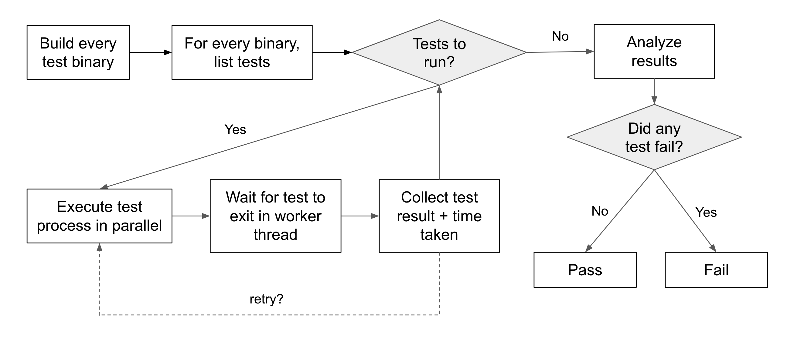

# How nextest works

To understand how nextest works, it is useful to first look at the execution model used by cargo test.

## The cargo test execution model

By default, cargo test uses this execution model:

In this model, each test binary is run serially, and binaries are responsible for running individual tests in parallel.

This model provides the greatest flexibility because _the only interface between cargo test and the binary is the exit code_. For cargo test, a binary exiting with exit code 0 means that all tests within it passed, while a non-zero exit code means that some tests within it failed.

However, this model has several problems:

1. **There's no structured way to get individual test pass/fail status**, or the time taken by each test.
2. **The first binary failure means that no further tests are run**, unless `--no-fail-fast` is passed in. If that argument is passed in in CI scenarios, then failing test output is not printed at the end, making it hard to figure out which tests failed.
3. **Performance can be affected by test bottlenecks.** For example, if a binary has 20 tests and 19 of them take less than 5s, while one of them takes 60s, then the test binary will take 60s to complete execution. `cargo test` has no way to start running other test binaries in those last 55 seconds.

## The nextest model

cargo-nextest uses a very different execution model, inspired by state-of-the-art test runners used at large corporations. Here's what cargo-nextest does:

A cargo-nextest run has two separate phases:

- **The list phase.** cargo-nextest first builds all test binaries with `cargo test --no-run`, then queries those binaries to produce a list of all tests within them.
- **The run phase.** cargo-nextest then executes each individual test in a separate process, in parallel. It then collects, displays and aggregates results for each individual test.

This model solves all the problems of cargo test's execution model, at the cost of a _significantly_ thicker interface to test binaries. This means that **custom test harnesses [may need to be adapted](custom-test-harnesses.md) to work with cargo-nextest.**

## Contributing features back to cargo?

Readers may be wondering if any of this work will be contributed back to cargo.

There is currently [an ongoing effort](https://epage.github.io/blog/2023/06/iterating-on-test/) to add parts of nextest to cargo test. However, there are a few reasons nextest remains a separate project for now:

- As documented above, nextest has a significantly thicker interface with the test binary than Cargo does. `cargo test` cannot just change how it works without breaking backwards compatibility, while nextest did not have this constraint at the time it was created.
- While nextest aims to be stable as far as possible, it has fewer stability guarantees than Cargo does. It is easier to experiment with improvements without having to worry about the long-term stability guarantees provided by Cargo, or go through the (necessarily) heavyweight Rust RFC process.
- Ultimately, the primary maintainer of nextest considers it a more efficient use of their time to maintain nextest, than to try and port the changes over to `cargo test` (which won't make nextest fully redundant anyway, so it would still need to be maintained).

With all that said, we'd love to see how cargo changes over time. However the expectation is that nextest will always have a role as a place to experiment with UX and workflow improvements.
