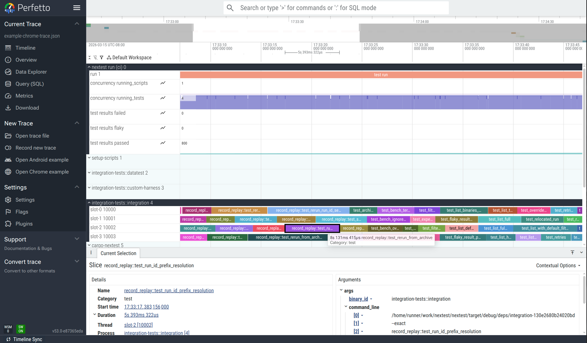

# Perfetto traces

<!-- md:version 0.9.131 -->

Nextest supports exporting traces in the [Chrome Trace Event format](https://docs.google.com/document/d/1CvAClvFfyA5R-PhYUmn5OOQtYMH4h6I0nSsKchNAySU/preview?tab=t.0#heading=h.yr4qxyxotyw). Chrome traces can be imported into [Perfetto](https://ui.perfetto.dev/) for visualization and analysis. Traces can also be loaded in Chrome's built-in viewer at `chrome://tracing`, though Perfetto is recommended for its richer UI and SQL query support.

Traces cover the test execution phase only; the build phase is not included.

## Use cases

Perfetto traces can be used to observe the timeline of a test run, and to find bottlenecks or long-pole tests that might be affecting test execution speed. For example, Perfetto traces can be used to identify slow tests holding up test runs, in order to [prioritize them first](../../configuration/test-priorities.md).

Perfetto also has a built-in query language called [PerfettoSQL](https://perfetto.dev/docs/analysis/perfetto-sql-getting-started). For example queries, see [_Example queries_](#example-queries) below.

## Prerequisites

To enable run recording, see [_Setting up run recording_](index.md#setting-up-run-recording).

## Exporting traces

To export the latest recording as a Chrome trace:

```bash
cargo nextest store export-chrome-trace latest
```

By default, this prints the trace to standard output. To instead write the trace to a file, use the `-o`/`--output` option:

```bash
cargo nextest store export-chrome-trace latest -o trace.json
```

Traces can also be exported from a [portable recording](portable-recordings.md), e.g., a recording generated in CI:

```bash
cargo nextest store export-chrome-trace my-run.zip
```

By default, data is produced in a compact JSON format. For prettified JSON, use `--message-format json-pretty`:

```bash
cargo nextest store export-chrome-trace latest --message-format json-pretty
```

An example of a trace loaded into the Perfetto web UI: [`ui.perfetto.dev`](https://ui.perfetto.dev/?url=https://nexte.st/static/example-chrome-trace.json).

<figure markdown="span">
  [{ width="80%" }](../../../static/perfetto-test-view.png)<figcaption markdown="span">Viewing a test in the Perfetto UI ([interactive view](https://ui.perfetto.dev/?url=https://nexte.st/static/example-chrome-trace.json))</figcaption>
</figure>

### Trace dimension mapping

Each test binary is considered a "process", and each global slot number (see [_Slot numbers_](../../glossary.md#slot-numbers)) is considered a "thread". Tests are shown as blocks within each slot.

- `pid` is a synthetic, numerically increasing ID unique to a binary ID.
- `tid` is the global slot number (starting from 0) plus 10 000.
- `name` is the name of the test.
- `cat` is typically `"test"` or `"run"`. For [setup scripts](../../configuration/setup-scripts.md) it is `"setup-script"`. For [stress sub-runs](../../features/stress-tests.md) it is `"stress"`.
- `ts` is the actual timestamp of each event.
- `args` contains metadata for each test, such as whether it passed or failed.

??? example "Example events for a test"

    The following is a pair of B (begin) and E (end) events for a single test, extracted from the [example trace](https://ui.perfetto.dev/?url=https://nexte.st/static/example-chrome-trace.json). Together, these two events define the duration of the test `test_archive_with_build_filter` in the `integration-tests::integration` binary.

    The begin event (`"ph": "B"`) is emitted when the test starts. The `args` contain the binary ID, test name, and the command line used to run the test.

    ```json
    {
      "name": "test_archive_with_build_filter",
      "cat": "test",
      "ph": "B",
      "ts": 1773896819127008.0,
      "pid": 3,
      "tid": 10000,
      "args": {
        "binary_id": "integration-tests::integration",
        "test_name": "test_archive_with_build_filter",
        "command_line": [
          "/path/to/target/debug/deps/integration-06fc3653fb286b3a",
          "--exact",
          "test_archive_with_build_filter",
          "--nocapture"
        ]
      }
    }
    ```

    The end event (`"ph": "E"`) is emitted when the test finishes. The `args` are enriched with result information: status, duration, attempt count, and whether the test was slow.

    ```json
    {
      "name": "test_archive_with_build_filter",
      "cat": "test",
      "ph": "E",
      "ts": 1773896837615619.0,
      "pid": 3,
      "tid": 10000,
      "args": {
        "binary_id": "integration-tests::integration",
        "test_name": "test_archive_with_build_filter",
        "time_taken_ms": 18488.306286,
        "result": {
          "status": "pass"
        },
        "attempt": 1,
        "total_attempts": 1,
        "is_slow": false,
        "test_group": "my-group"
      }
    }
    ```

    Note that `pid` 3 corresponds to the `integration-tests::integration` binary (set via a `process_name` metadata event), and `tid` 10000 corresponds to slot 0 (10000 = slot number + TID offset of 10000).

There is also a global "nextest run" process with a bar for the overall run, as well as several time-series (counter) plots:

- `concurrency running_scripts` shows the number of setup scripts running at a given time.
- `concurrency running_tests` shows the number of tests running at a given time.
- `test results passed`, `test results failed`, and `test results flaky` contain the number of tests passed, failed, and flaky respectively.

### Grouping by slot

By default, each test binary is treated as a separate process. To combine all test binaries into a single process grouped by concurrency slot, use `--group-by slot`:

```
cargo nextest store export-chrome-trace latest --group-by slot
```

This is useful when you care about how well concurrency slots are packed rather than which binary a test belongs to; for example, to see if slots are sitting idle between tests.

## PerfettoSQL queries

Perfetto has a powerful query language, [PerfettoSQL](https://perfetto.dev/docs/analysis/perfetto-sql-getting-started), that can be used to analyze test runs. Queries can be run in the "Query (SQL)" view, or via the omnibox at the top of the page.

Try running the example queries below against the [interactive example](https://ui.perfetto.dev/?url=https://nexte.st/static/example-chrome-trace.json).

### Example queries

!!! note

    These queries use `args.binary_id` and `args.test_name` embedded in the metadata, as opposed to using the Perfetto thread name (`name`) and process name (`process_name`) fields. This means they work with both the default `--group-by binary` and with `--group-by slot`.
    
    These queries also use the embedded `time_taken_ms`, which is generally the same as the duration computed by Perfetto, but works properly in case a test run is paused with Ctrl-Z (SIGTSTP) and resumed later.
    
    For maximum compatibility, it is recommended that your queries follow the same patterns.

Print a list of the top 20 slowest tests:

```sql
SELECT
  EXTRACT_ARG(arg_set_id, 'args.binary_id') AS binary_id,
  EXTRACT_ARG(arg_set_id, 'args.test_name') AS test_name,
  EXTRACT_ARG(arg_set_id, 'args.time_taken_ms') AS time_taken_ms
FROM slice
WHERE category = 'test'
ORDER BY time_taken_ms DESC
LIMIT 20;
```

Total test time per binary:

```sql
SELECT
  EXTRACT_ARG(arg_set_id, 'args.binary_id') AS binary_id,
  COUNT(*) AS test_count,
  SUM(EXTRACT_ARG(arg_set_id, 'args.time_taken_ms')) AS total_ms,
  AVG(EXTRACT_ARG(arg_set_id, 'args.time_taken_ms')) AS avg_ms,
  MAX(EXTRACT_ARG(arg_set_id, 'args.time_taken_ms')) AS max_ms,
  MIN(EXTRACT_ARG(arg_set_id, 'args.time_taken_ms')) AS min_ms
FROM slice
WHERE category = 'test'
GROUP BY binary_id
ORDER BY total_ms DESC;
```

Duration distribution histogram:

```sql
SELECT
  CASE
    WHEN time_taken_ms < 100 THEN '< 100ms'
    WHEN time_taken_ms < 1000 THEN '100ms - 1s'
    WHEN time_taken_ms < 5000 THEN '1s - 5s'
    WHEN time_taken_ms < 10000 THEN '5s - 10s'
    WHEN time_taken_ms < 30000 THEN '10s - 30s'
    ELSE '> 30s'
  END AS bucket,
  COUNT(*) AS count
FROM (
  SELECT EXTRACT_ARG(arg_set_id, 'args.time_taken_ms') AS time_taken_ms
  FROM slice
  WHERE category = 'test'
)
GROUP BY bucket
ORDER BY MIN(time_taken_ms);
```

Setup script statuses and durations:

```sql
SELECT
  EXTRACT_ARG(arg_set_id, 'args.script_id') AS script_id,
  EXTRACT_ARG(arg_set_id, 'args.time_taken_ms') AS time_taken_ms,
  EXTRACT_ARG(arg_set_id, 'args.result.status') AS status
FROM slice
WHERE category = 'setup-script'
ORDER BY time_taken_ms DESC;
```

Tests in a non-default test group:

```sql
SELECT
  EXTRACT_ARG(arg_set_id, 'args.binary_id') AS binary_id,
  EXTRACT_ARG(arg_set_id, 'args.test_name') AS test_name,
  EXTRACT_ARG(arg_set_id, 'args.test_group') AS test_group,
  EXTRACT_ARG(arg_set_id, 'args.time_taken_ms') AS time_taken_ms
FROM slice
WHERE category = 'test'
  AND EXTRACT_ARG(arg_set_id, 'args.test_group') != '@global'
ORDER BY time_taken_ms DESC;
```

Retried tests:

```sql
SELECT
  EXTRACT_ARG(arg_set_id, 'args.binary_id') AS binary_id,
  EXTRACT_ARG(arg_set_id, 'args.test_name') AS test_name,
  EXTRACT_ARG(arg_set_id, 'args.attempt') AS attempt,
  EXTRACT_ARG(arg_set_id, 'args.total_attempts') AS total_attempts,
  EXTRACT_ARG(arg_set_id, 'args.result.status') AS status,
  EXTRACT_ARG(arg_set_id, 'args.time_taken_ms') AS time_taken_ms
FROM slice
WHERE category = 'test'
  AND EXTRACT_ARG(arg_set_id, 'args.total_attempts') > 1
ORDER BY binary_id, test_name, attempt;
```

Slot utilization (how busy each concurrency slot was):

```sql
SELECT
  t.name AS slot,
  COUNT(*) AS tests_run,
  SUM(EXTRACT_ARG(s.arg_set_id, 'args.time_taken_ms')) AS busy_ms
FROM slice s
JOIN thread_track tt ON s.track_id = tt.id
JOIN thread t USING (utid)
WHERE s.category = 'test'
GROUP BY t.name
ORDER BY busy_ms DESC;
```

### Discovering available metadata

Nextest embeds test metadata (binary ID, result status, attempt count, test group, etc.) as args on each trace event. To see all available keys for test events, run:

```sql
SELECT DISTINCT flat_key
FROM args
WHERE arg_set_id IN (
  SELECT arg_set_id FROM slice WHERE category = 'test' LIMIT 1
);
```

These keys can then be accessed with `EXTRACT_ARG(arg_set_id, '<key>')` in queries.

## Learn more

- [_What is Perfetto?_](https://perfetto.dev/docs/)
- [Perfetto UI documentation](https://perfetto.dev/docs/visualization/perfetto-ui)
- [_Getting started with PerfettoSQL_](https://perfetto.dev/docs/analysis/perfetto-sql-getting-started)

## Options and arguments

### `cargo nextest store export-chrome-trace`

=== "Summarized output"

    The output of `cargo nextest store export-chrome-trace -h`:

    === "Colorized"

        ```bash exec="true" result="ansi"
        CLICOLOR_FORCE=1 cargo nextest store export-chrome-trace -h | ../scripts/strip-hyperlinks.sh
        ```

    === "Plaintext"

        ```bash exec="true" result="text"
        cargo nextest store export-chrome-trace -h | ../scripts/strip-ansi.sh | ../scripts/strip-hyperlinks.sh
        ```

=== "Full output"

    The output of `cargo nextest store export-chrome-trace --help`:

    === "Colorized"

        ```bash exec="true" result="ansi"
        CLICOLOR_FORCE=1 cargo nextest store export-chrome-trace --help | ../scripts/strip-hyperlinks.sh
        ```

    === "Plaintext"

        ```bash exec="true" result="text"
        cargo nextest store export-chrome-trace --help | ../scripts/strip-ansi.sh | ../scripts/strip-hyperlinks.sh
        ```
