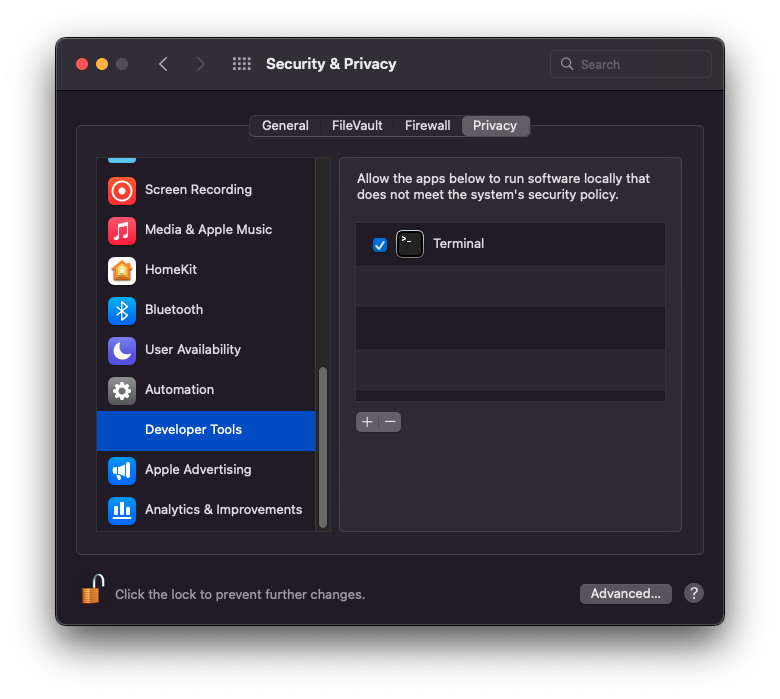

# Nextest on macOS

While macOS is generally similar to other Unix platforms, there are some notably unique aspects to it that are relevant to nextest.

## Gatekeeper

macOS has a system called **Gatekeeper** which performs checks on binaries. Gatekeeper can cause nextest runs to be significantly slower. A typical sign of this happening is even the simplest of tests in `cargo nextest run` taking more than 0.2 seconds.

Adding your terminal to Developer Tools will cause any processes run by it to be excluded from Gatekeeper. **For optimal performance, add your terminal to Developer Tools.** You may also need to run `cargo clean` afterwards.

### How to add your terminal to Developer Tools

1. Run `sudo spctl developer-mode enable-terminal` in your terminal.
2. Go to System Preferences, and then to Security & Privacy.
3. Under the Privacy tab, an item called `Developer Tools` should be present. Navigate to it.
4. Ensure that your terminal is listed and enabled. If you're using a third-party terminal like iTerm, be sure to add it to the list. (You may have to click the lock in the bottom-left corner and authenticate.)
5. Restart your terminal.

[See this comment on Hacker News for more.](https://news.ycombinator.com/item? id=24394150)



!!! note

    There are still some reports of performance issues on macOS after Developer Tools have been enabled. If you're seeing this, please [add a note to this issue](https://github.com/nextest-rs/nextest/issues/63)!

## Dynamic linker environment variables

macOS has a feature called [System Integrity Protection (SIP)](https://developer.apple.com/library/archive/documentation/Security/Conceptual/System_Integrity_Protection_Guide/RuntimeProtections/RuntimeProtections.html) for hardening the base OS. One of the things SIP does is [sanitize dynamic linker environment variables](https://briandfoy.github.io/macos-s-system-integrity-protection-sanitizes-your-environment/) for system-managed processes like the system `sh`.

For example, the macOS dynamic linker uses the `DYLD_LIBRARY_PATH` variable to determine the list of directories to load libraries from. This is called `LD_LIBRARY_PATH` on most other Unix platforms.

If you run the following command on most Unix platforms, you'll get:

```console
$ LD_LIBRARY_PATH="/path/to/lib" /bin/sh -c 'echo library_path: $LD_LIBRARY_PATH'
library_path: /path/to/lib

$ DYLD_LIBRARY_PATH="/path/to/lib" /bin/sh -c 'echo library_path: $DYLD_LIBRARY_PATH'
library_path: /path/to/lib
```

But on macOS with SIP enabled, you'll get:

```console
$ DYLD_LIBRARY_PATH="/path/to/lib" /bin/sh -c 'echo library_path: $DYLD_LIBRARY_PATH'
library_path:
```

(Note that if `sh` is not system-managed, e.g. if it is installed by Homebrew, then this sanitization does not occur.)

For nextest, this is a problem especially for [target runners](../features/target-runners.md), since they're often shell scripts. As a workaround, nextest sets `NEXTEST_LD_*` and `NEXTEST_DYLD_*` environment variables that replicate the values of any environment variables that start with the `LD_` and `DYLD_` prefixes, respectively.

For consistency, these variables are exported on all platforms, not just macOS.
