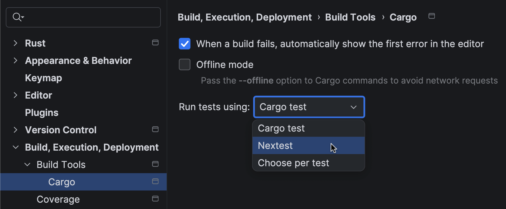

# RustRover

Nextest integrates with the JetBrains [RustRover IDE](https://www.jetbrains.com/rust/).

## Requirements

- RustRover 2026.1 or above
- A recent version of nextest.

## Running tests from within RustRover

In Settings, under _Build, Execution, Deployment -> Build Tools -> Cargo -> Run tests using_, choose nextest.

Then, if you run a test from within the UI, RustRover will invoke nextest.

!!! note "Debugging from RustRover"

    Currently, RustRover does not support debugging tests with the nextest environment configured. For more, see [_Debugger and tracer integration_](debuggers-tracers.md).

## Learn more

- [RustRover 2026.1: Professional Testing With Native cargo-nextest Integration](https://blog.jetbrains.com/rust/2026/04/03/rustrover-2026-1-professional-testing-with-native-cargo-nextest-integration/) on the JetBrains blog
- [RustRover documentation on nextest](https://www.jetbrains.com/help/rust/nextest.html)
