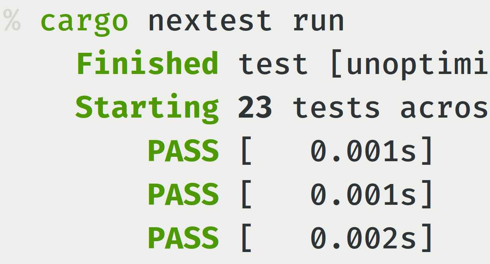

<div class="grid cards" markdown>

-   :octicons-sparkles-fill-16:{ .lg .middle } __Clean, beautiful user interface__

    ---

    

    See which tests passed and failed at a glance.

    [:octicons-arrow-right-24: Running tests](docs/running.md)

-   :material-clock-fast:{ .lg .middle } __Up to 3x as fast as cargo test__

    ---

    Nextest uses a modern [execution model](docs/design/how-it-works.md) for faster, more reliable test runs.

    [:octicons-arrow-right-24: Benchmarks](docs/benchmarks/index.md)

-   :material-filter-variant:{ .lg .middle } __Powerful test selection__

    ---

    Use a sophisticated [expression language](docs/filtersets/index.md) to select exactly the tests you need. Filter by name, binary, platform, or any combination.

    [:octicons-arrow-right-24: Filtersets](docs/filtersets/index.md)

-   :material-speedometer-slow:{ .lg .middle } __Identify misbehaving tests__

    ---

    Treat tests as cattle, not pets. Detect and terminate [slow tests](docs/features/slow-tests.md). Loop over tests many times with [stress testing](docs/features/stress-tests.md).

    [:octicons-arrow-right-24: Slow tests and timeouts](docs/features/slow-tests.md)

-   :material-chevron-double-right:{ .lg .middle } __Customize settings by test__

    ---

    Automatically [retry](docs/features/retries.md) some tests, mark them as [heavy](docs/configuration/threads-required.md), run them [serially](docs/configuration/test-groups.md), and much more.

    [:octicons-arrow-right-24: Per-test settings](docs/configuration/per-test-overrides.md)

-   :material-replay:{ .lg .middle } __Record, replay and rerun__

    ---

    [Record](docs/features/record-replay-rerun/index.md) every test run. [Replay](docs/features/record-replay-rerun/replay.md) CI runs locally. [Rerun](docs/features/record-replay-rerun/rerun.md) failing tests. Export [Perfetto traces](docs/features/record-replay-rerun/perfetto-chrome-traces.md) for deep analysis.

    [:octicons-arrow-right-24: Record, replay, and rerun](docs/features/record-replay-rerun/index.md)

-   :octicons-git-merge-24:{ .lg .middle } __Designed for CI__

    ---

    [Archive](docs/ci-features/archiving.md) and [partition](docs/ci-features/partitioning.md) tests across multiple workers, export [JUnit XML](docs/machine-readable/junit.md), and use [profiles](docs/configuration/index.md#profiles) for different environments.

    [:octicons-arrow-right-24: Configuration profiles](docs/configuration/index.md#profiles)

-   :material-script-text-outline:{ .lg .middle } __Setup scripts__

    ---

    Run [setup scripts](docs/configuration/setup-scripts.md) before tests start with per-test scoping. Initialize databases, start services, and prepare fixtures.

    [:octicons-arrow-right-24: Setup scripts](docs/configuration/setup-scripts.md)

-   :material-vector-combine:{ .lg .middle } __An ecosystem of tools__

    ---

    Collect [test coverage](docs/integrations/test-coverage.md). Do [mutation testing](docs/integrations/cargo-mutants.md). Spin up [debuggers](docs/integrations/debuggers-tracers.md). Observe system behavior with [DTrace and bpftrace probes](docs/integrations/usdt.md).

    [:octicons-arrow-right-24: Integrations](docs/integrations/index.md)

-   :material-language-rust:{ .lg .middle } __Cross-platform__

    ---

    Runs on Linux, Mac, Windows, and other Unix-like systems. Download binaries or build it [from source](docs/installation/from-source.md).

    [:octicons-arrow-right-24: Pre-built binaries](docs/installation/pre-built-binaries.md)

-   :material-scale-balance:{ .lg .middle } __Open source, widely trusted__

    ---

    Powers Rust development at every scale, from independent open source projects to the world's largest tech companies.

    [:octicons-arrow-right-24: License (Apache 2.0)](https://github.com/nextest-rs/nextest/blob/main/LICENSE-APACHE)

-   :material-heart-circle:{ .lg .middle } __State-of-the-art, made with love__

    ---

    Nextest brings [infrastructure-grade reliability](docs/design/why-process-per-test.md) to test runners, [with _care_](docs/design/architecture/runner-loop.md) about getting the details right.

    [:octicons-arrow-right-24: Sponsor on GitHub](https://github.com/sponsors/sunshowers)

</div>

## Quick start

Install cargo-nextest using the [pre-built binaries](docs/installation/pre-built-binaries.md), then run:

```
cargo nextest run
```

!!! note

    Doctests are currently [not supported](https://github.com/nextest-rs/nextest/issues/16) because of limitations in stable Rust. For now, run doctests in a separate step with `cargo test --doc`.
